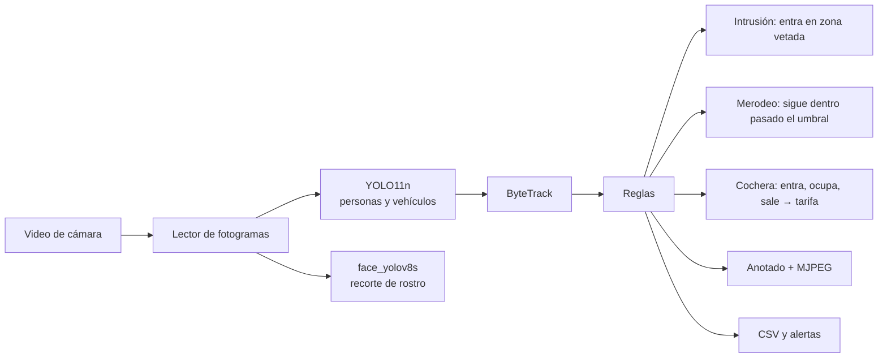

# OMNI Guard — seguridad para casa y negocio

> **Visión computacional · YOLO11 + ByteTrack · FastAPI · CUDA o CPU**
>
> 
> 
> 
> 


## El problema

Una cámara de seguridad graba. No avisa. Alguien tiene que estar mirando la
pantalla, o revisar las horas de grabación después de que ya pasó algo.

Y en una cochera de barrio, el cobro se lleva en un cuaderno: quién entró, a
qué hora, cuánto debe. Se discute, se olvida, se pierde.

OMNI Guard hace las dos cosas sobre el mismo video: **avisa mientras pasa** y
**cobra por tiempo sin que nadie apunte nada**.

| Módulo | Qué responde | Con qué |
|---|---|---|
| **Garaje** | ¿Qué plaza está ocupada, desde cuándo, y cuánto se debe? | Zonas por plaza; el cobro sale del tiempo dentro |
| **Vigilancia** | ¿Alguien entró donde no debía? ¿Alguien lleva rato dando vueltas? | Zonas de intrusión y umbral de merodeo |
| **Rostros** | ¿Quién pasó por la entrada? | Recorte de cara con `face_yolov8s` a partir de ~28 px |

## Qué se ve

| | |
|---|---|
| **Cochera con cobro por tiempo**<br><br><sub>plazas ocupadas, tiempo dentro e importe acumulado</sub> | **Vigilancia**<br><br><sub>intrusión y merodeo sobre zonas dibujadas</sub> |
| **Editor de zonas**<br><br><sub>una plaza es un polígono; se dibuja una vez</sub> |  |

## Cómo funciona

<a href="docs/flujo.svg">
  
</a>

<sub>Ábrelo en grande: <a href="docs/flujo.svg"><code>docs/flujo.svg</code></a>.
Las cifras de las tarjetas no están escritas a mano — las pone
<a href="scripts/diagrama.py"><code>scripts/diagrama.py</code></a> leyendo
<code>docs/modelos.json</code>, que a su vez genera
<a href="scripts/medir_modelos.py"><code>scripts/medir_modelos.py</code></a>
midiendo los modelos de verdad. Si mañana se cambia un modelo, se corren los
dos y el dibujo se corrige solo.</sub>

### El mismo recorrido, en corto



**El cobro usa el tiempo del video, no el reloj.** Para la demo es lo correcto:
un video de 30 segundos tiene que producir un importe comprobable. En
producción se cambia por reloj real, y es una línea.

**El merodeo necesita un umbral, no una detección.** Nadie «merodea» en un
fotograma: se detecta estando dentro de la zona más tiempo del razonable. Ese
umbral es lo único que separa una alarma útil de una que suena cada vez que
alguien se ata un zapato.

<!-- MODELOS:inicio -->

### Qué tan bien detecta cada modelo

| Modelo | Para qué | Precisión | Recall | mAP@50 | mAP@50-95 | La cifra sale de |
|---|---|---|---|---|---|---|
| **`yolo11n.pt`** | Personas y vehículos | 65.6 % | 50.2 % | 55.1 % | 39.4 % | el propio `.pt` |
| **`face_yolov8s.pt`** | Rostros, para el recorte de la entrada | — | — | 71.3 % | 40.4 % | [su documentación](https://huggingface.co/Bingsu/adetailer)<br><sub>rostro realista · WIDER FACE y otros</sub> |

<sub>Ninguna de estas cifras se calcula aquí, y la última columna dice cuál es cuál. <b>El propio <code>.pt</code></b>: Ultralytics guardó dentro del archivo la validación del entrenamiento que lo produjo, así que es el acierto que midió quien lo entrenó sobre <i>su</i> conjunto. <b>Su documentación</b>: ese archivo no guardó métricas, y se cita lo que publica su autor con enlace para comprobarlo. <b>No publicado</b>: no hay cifra en ninguna parte, y se dice en vez de rellenar el hueco.<br>En los tres casos son cifras sobre el conjunto de validación de quien entrenó, <b>no</b> sobre los videos de este proyecto. Medir eso exigiría etiquetar a mano esta operación concreta, que es trabajo que un MVP todavía no ha hecho; un porcentaje inventado sería peor que ninguno. Comprobación de que la lectura del <code>.pt</code> es correcta: <code>yolo11n</code> sale con mAP@50-95 = 39,4 % y Ultralytics publica 39,5 % para ese modelo en COCO.</sub>

### De dónde sale cada modelo

| Modelo | Entrenado sobre | Épocas | Resolución | Origen |
|---|---|---|---|---|
| **`yolo11n.pt`** | `coco` | 600 | 640×640 | [Ultralytics · COCO 2017](https://docs.ultralytics.com/models/yolo11/) |
| **`face_yolov8s.pt`** | `data` | 100 | 640×640 | Detector de rostro de adetailer |

<sub>El conjunto, las épocas y la resolución salen de <code>train_args</code>, que Ultralytics guarda dentro del propio <code>.pt</code>. Es decir: no es lo que dice la ficha del modelo, es lo que quedó grabado en el archivo que este repositorio carga de verdad. Los nombres de conjunto son los del disco de quien entrenó —<code>retrain_data</code>, <code>safe_human</code>— porque es literalmente lo que hay dentro.</sub>

### Cuánto tarda cada uno, medido aquí

| Modelo | Parámetros | Clases | Latencia (mejor) | Latencia (mediana) | Umbral | Det./fotograma | Confianza media |
|---|---|---|---|---|---|---|---|
| **`yolo11n.pt`** | 2.6 M | 80 | 17.9 ms · 56 fps | 20.5 ms · 48.7 fps | `0.30` | 1.4 | 0.632 |
| **`face_yolov8s.pt`** | 11.1 M | 1 | 21.0 ms · 48 fps | 26.3 ms · 38.0 fps | `0.30` | 12.5 | 0.706 |

<sub>Esto sí se mide aquí, con <a href="scripts/medir_modelos.py"><code>scripts/medir_modelos.py</code></a>, sobre fotogramas reales de los videos del repositorio, en una RTX 3060 Laptop y a la resolución que usa la aplicación. Sesenta fotogramas, descartando los veinte primeros. El umbral es el que usa la aplicación, y va en la tabla porque «det./fotograma» no significa nada sin él: el mismo modelo a 0.05 y a 0.50 devuelve cantidades incomparables. «Confianza media» es la media de la puntuación de lo que pasó ese umbral — no es acierto, pero dice si el modelo trabaja cómodo o al límite en este material.<br>Se dan <b>dos</b> latencias a propósito. Esta GPU está a 210 MHz en reposo y tarda segundos en subir de reloj, así que la mediana se mueve bastante entre pasadas —el mismo <code>yolo11n</code> ha dado 20 y 48 fps— mientras que el mejor caso es estable y representa lo que la máquina puede sostener. Dar solo la cifra buena sería vender de más; dar solo la mediana, castigar al modelo por la gestión de energía del portátil.</sub>

### Los umbrales que usa este proyecto

Una cifra de mAP sin el umbral al que se trabaja no dice nada: el mismo modelo a 0.05 y a 0.50 se comporta como dos modelos distintos. Estos son los valores por defecto, todos cambiables por variable de entorno sin tocar código.

| Umbral | Valor | Por qué ese y no otro |
|---|---|---|
| Confianza · personas y vehículos | **`0.30`** | Más bajo que en retail: la cámara está más lejos y una persona en el fondo del garaje sale pequeña. Un falso positivo aquí cuesta poco; no detectar a alguien que entra, mucho. |
| IoU de NMS | **`0.60`** | Funde las cajas dobles sobre el mismo coche o la misma persona. |
| Activación de ByteTrack | **`0.25`** | Por debajo de la confianza de detección, para no perder el ID de alguien que se tapa un momento tras una columna. |
| Confianza · rostro | **`0.30`** | Con cara mínima de ~28 px. Por debajo salen recortes que no son una cara, y eso es peor que no recortar nada. |
| Fotogramas para confirmar un rostro | **`3`** | Un solo fotograma bueno puede ser un reflejo. Tres seguidos, no. |

<!-- MODELOS:fin -->

## Datos personales

**Los recortes de rostro no se versionan.** Son datos biométricos de personas
reales que nunca dieron su consentimiento — en varios videos de prueba salen de
la calle. Publicarlos en un repositorio abierto no es un problema de tamaño:
expone a personas identificables, y en Perú lo cubre la **Ley 29733** de
protección de datos personales.

El código que los produce sí está aquí. Las caras no, y por eso no hay ninguna
captura de la galería de rostros en este README.

## Probarlo

```bash
pip install -r requirements.txt
python download_models.py
python -m uvicorn backend.main:app --port 8030    # o arrancar.bat
```

### Por qué los pesos y los videos no están aquí

No son código: son la entrada y la salida del sistema. Varios pasan de los
100 MB que GitHub rechaza de plano, y clonar el proyecto pasaría de segundos a
minutos para traerse archivos que se regeneran o se descargan.

```bash
python download_models.py          # los recupera y dice cuáles faltan
```

## Cómo está montado

```
backend/
├── config.py     todo por variable de entorno, tarifa incluida
├── detector.py   personas/vehículos y rostros, cargados al usarse
├── processor.py  el bucle: leer, detectar, seguir, anotar, emitir
├── analytics.py  reglas de intrusión y merodeo + cálculo del cobro
├── zones.py      plazas y zonas vetadas, guardadas en 0..1
└── main.py       API, MJPEG y galería de rostros
frontend/         interfaz sin framework
scripts/          generadores de las capturas y del diagrama de ramas
run_video.py      procesa un video entero a archivo, sin navegador
```

## Ajustes (`.env`)

| Clave | Para qué |
|---|---|
| `DEVICE` | `cuda` o `cpu` |
| `TARIFA_HORA` | Precio por hora de la cochera |
| `LOITER_SEC` | Segundos dentro de zona que cuentan como merodeo |
| `FACE_MIN_PX` | Tamaño mínimo de cara para intentar el recorte |
| `WORK_RES` | Resolución de inferencia |

## Pruebas

```bash
python -m pytest -q
```

Veinte comprobaciones en cinco bloques: config y pesos, ocupación de cochera y
**cobro por tiempo**, intrusión y merodeo sobre recorridos sintéticos, captura
de rostros en 80 fotogramas reales, y una pasada de garaje de 300 fotogramas
que tiene que acabar generando ingresos.

Un detector que falla se ve en pantalla; una regla de merodeo mal puesta no —
solo suena de más, o no suena nunca. Lo que falta por no venir en el
repositorio se **salta**, no se da por bueno.

<!-- GITFLOW:inicio -->

## Cómo se trabajó

**21 commits**, **12 fusiones** y **5 etiquetas** (`v0.1.0`, `v0.2.0`, `v0.3.0`, `v0.4.0`, `v0.5.0`). al generar este bloque. Cada rama entra con `--no-ff`: un merge aplastado ahorra una línea y borra la única prueba de que aquello fue una tarea con principio y final.

```mermaid
gitGraph
   commit id: "import"
   branch develop
   checkout develop
   branch feature/repository-hygiene
   checkout feature/repository-hygiene
   commit
   checkout develop
   merge feature/repository-hygiene
   checkout main
   merge develop tag: "v0.1.0"
   checkout develop
   branch feature/tests-that-actually-fail
   checkout feature/tests-that-actually-fail
   commit
   checkout develop
   merge feature/tests-that-actually-fail
   checkout main
   merge develop tag: "v0.2.0"
   checkout develop
   branch feature/documentation
   checkout feature/documentation
   commit
   checkout develop
   merge feature/documentation
   checkout main
   merge develop tag: "v0.3.0"
   checkout main
   merge develop tag: "v0.4.0"
   checkout develop
   branch feature/pipeline-diagram-and-model-metrics
   checkout feature/pipeline-diagram-and-model-metrics
   commit
   checkout develop
   merge feature/pipeline-diagram-and-model-metrics
   checkout main
   merge develop tag: "v0.5.0"
   checkout develop
   branch main
   checkout main
   commit
   checkout develop
   merge main
   checkout develop
   branch feature/documented-metrics-and-thresholds
   checkout feature/documented-metrics-and-thresholds
   commit
   checkout develop
   merge feature/documented-metrics-and-thresholds
   checkout main
   merge develop
```

| Prefijo | Para qué | Ramas |
|---|---|---|
| `develop/` | rama de integración | 6 |
| `feature/` | trabajo acotado, se integra en develop | 5 |
| `main/` | otros | 1 |

| Rama | Responsabilidad | Regla de salida |
|---|---|---|
| `main` | Lo que ve primero quien llega al repositorio | Solo recibe trabajo terminado y con las pruebas en verde |
| `develop` | Integración: aquí se junta todo antes de subir | Merge `--no-ff` desde una rama `feature/*` |
| `feature/*` | Un trabajo acotado, nombrado por lo que hace | Merge `--no-ff` a `develop` con sus pruebas escritas |

Los mensajes siguen *Conventional Commits* y están en inglés. Explican **por qué**, no qué: el *qué* ya está en el diff. Varios cuentan el fallo que arreglan y cómo se descubrió, que es lo que sirve dentro de seis meses.

<sub>El diagrama lo genera <a href="scripts/gitflow.py"><code>scripts/gitflow.py</code></a> leyendo <code>git log --merges</code>.</sub>

<!-- GITFLOW:fin -->

---

## Licencia

Uso interno de ApexCorp S.A.C.

<sub>OMNI Guard · ApexCorp S.A.C. — desarrollado por
<a href="https://github.com/danielyatacoblas">Daniel Yataco Blas</a></sub>
